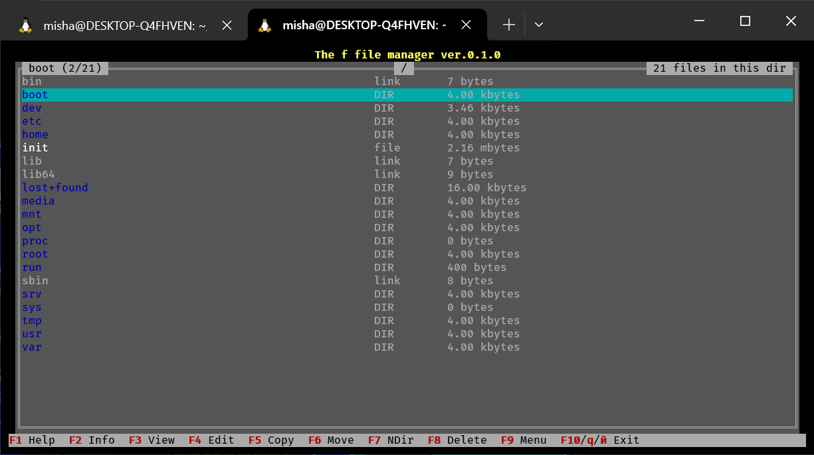

# f

f - very simple and stupid (yet) console file manager for UNIX systems. Written just for learning Rust and Linux, don't take the project as something serious. It's a common student craft.



## Features

- [X] View directory contents, navigates beetwen directories;
- [X] Removing files;
- [ ] Copying files;
- [ ] Moving/renaming files;
- [ ] View information about file;
- [ ] Creating directories and files;
- [ ] Formatting disks (need `root` permissions);
- [X] Color schemes;

## Interface

The interface is divided into two panels: the first panel contains a list of files in the current directory, the second panel displays information about the file and the `f` file manager.

### Usage

**Hotkeys:**

<!-- - <kbd>F1</kbd> - print help;
- <kbd>F2</kbd> - view file metadata in right panel;
- <kbd>F3</kbd> - view file contents in right panel;
- <kbd>F4</kbd> - open file in the internal program (editor or other software);
- <kbd>F5</kbd> - copy file in the specified path;
- <kbd>F6</kbd> - move/rename file;
- <kbd>F7</kbd> - create new directory; -->
- <kbd>F8</kbd> - delete file;
<!-- - <kbd>F9</kbd> - select menubar; -->
- <kbd>F10</kbd>, <kbd>q</kbd>, <kbd>й</kbd> - exit `f`;
<!-- - <kbd>Tab</kbd> - switch between panels (TODO);
- <kbd>Shift</kbd> - select file/dir (TODO); -->
- <kbd>~</kbd> - go to the home directory (`~`);
- <kbd>/</kbd> - go to the root directory (`/`);
- <kbd>.</kbd> - show hidden files;

## Build & install

### Dependencies

- Rust toolchain (`rustc`, `cargo`);
- `git`;
- Bash or bash-compatible shell (`/bin/sh` must be a link to it);

### Local build

- Get the source code:

```bash
git clone https://github.com/mskrasnov/f/
cd f
```

- Build:

```bash
cargo build --release
```

- Install:

```bash
export F_BIN_DIR="$HOME/.local/bin/"
cp -v ./target/release/f $F_BIN_DIR
export PATH=$PATH:$F_BIN_DIR
```

## Technology stack

- **OS:** UNIX-like (for now there are only Linux builds; support for other UNIX-like OS depending on their support for rust stdlib and some other OS-specific libraries used in `f`);
- **Programming language:** Rust; POSIX Shell;
- **User interface:** TUI via [ratatui](https://ratatui.rs);
- **User languages:** English; Russian (coming soon) via `fluent`;

## License

`f` is distributed under the MIT license.
